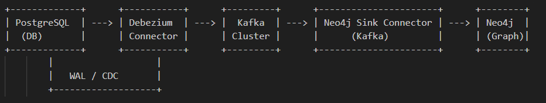
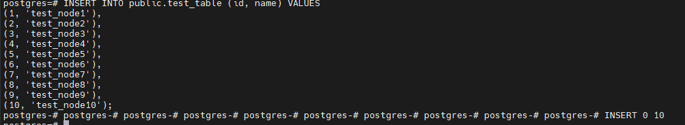
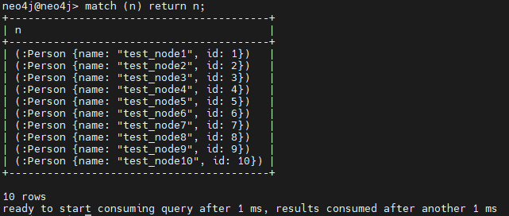

# PostgreSQL -> Kafka -> Neo4j

### Introduction
Hello! If you’re looking to stream real-time updates (change data capture) from a PostgreSQL table to a Neo4j database using Kafka, you’re in the right place. While this can be done with a Python script and SQL triggers, Kafka provides a more stable and scalable solution for large datasets. This guide explains the process step by step. This setup is intended for development purposes, so both PostgreSQL and Neo4j run on localhost. You can modify the configuration to suit your needs.

#### Version and Environment:
Server: NAME="Rocky Linux", VERSION="8.10 (Green Obsidian)"
PostgreSQL version: 15 (localhost)
Neo4j version: neo4j-community-4.4.46
Neo4j plugins: neo4j-streams-4.1.9.jar
Kafka version: 3.9.0
Debezium Postgres Connector: 2.7.4
Neo4j Sink Connector: 4.1.2

#### Architecture:


#### Instructions:
1. Configure PostgreSQL
Debezium requires logical replication. Update postgresql.conf:
```bash
# edit the conf
sudo nano /etc/postgresql/15/main/postgresql.conf
```

Add or modify the following:
```bash
wal_level = logical                  # Enable logical replication
max_wal_senders = 10                 # Needed for Debezium connectors
max_replication_slots = 10           # One slot per connector
wal_keep_size = 64MB                  # Optional, keep WAL for slow consumers
```

Then restart
```bash
sudo systemctl restart postgresql
```
Verify settings:
```bash
SHOW wal_level;
SHOW max_wal_senders;
SHOW max_replication_slots;

# You should see
wal_level         | logical
max_wal_senders   | 10
max_replication_slots | 10
```

Create a replication user:
```bash
CREATE ROLE username WITH LOGIN PASSWORD 'dbz';
GRANT REPLICATION ON DATABASE your_db TO username;

# and create a publication on yout source table:
CREATE PUBLICATION my_publication FOR ALL TABLES; 
```
For this example, public.test_table in the postgres database is used.


2. I have transferred all the required jar files into kafka/plugins:
- neo4j-sink folder
- debezium-connector-postgres

3. I am using connect-distributed.sh to run this. You need to also start zookeeper and kafka server in the back. I have edit connect-distributed.sh in kafka/config to allow for kafka plugins.
```bash
bin/connect-distributed.sh config/connect-distributed.properties
```
4. (The most important) In the Kafka folder, you’ll find neo4j-sink-config.json and debezium-postgres.json. These files define the connector configurations in REST API format to set up both the Debezium and Neo4j Sink connectors. You may need to edit them to match your environment and configurations like host and password. Setting up the correct message format from Debezium so that Neo4j can process it took considerable effort. Be careful: even if messages successfully appear in the Kafka topic, the Neo4j Sink connector will not process them if the JSON format is incorrect.

Add the connectors to Kafka, edit your own path, this can only be executed when connect-distributed.sh is running:
```bash
# neo4j
curl -X POST http://localhost:8083/connectors \
  -H "Content-Type: application/json" \
  -d @/home/bigdata/kafka/neo4j-sink-config.json 
```
```bash
# postgres
curl -X POST http://localhost:8083/connectors \
  -H "Content-Type: application/json" \
  -d @/home/bigdata/kafka/debezium-postgres.json
```

5. Verify if connectors are added succesfully, this can only be executed when connect-distributed.sh is running:
```bash
curl http://localhost:8083/connectors
```
This will return the connector names:
[Neo4jSinkConnector, postgres-test-connector] 

6. Connector Configuration Overview ():
In debezium-postgres.json (Debezium Source Connector), the connector captures real-time changes from PostgreSQL and prepares the messages for Neo4j:
```bash
"transforms.unwrap.type": "io.debezium.transforms.ExtractNewRecordState",
"transforms.unwrap.drop.tombstones": "true",
"transforms.unwrap.delete.handling.mode": "drop",

"transforms.route.type": "org.apache.kafka.connect.transforms.RegexRouter",
"transforms.route.regex": "pgserver1\\.public\\.test_table",
"transforms.route.replacement": "neo4j-topic"
```
Key points:
-Unwrapping messages
-ExtractNewRecordState extracts only the row data (ignoring Debezium metadata).
-Tombstone messages are dropped, and delete events are ignored, preventing unnecessary deletions in Neo4j.

Topic routing:
-RegexRouter renames the original PostgreSQL topic (pgserver1.public.test_table) to a Neo4j-friendly topic (neo4j-topic).This ensures the Neo4j Sink Connector consumes from a predictable topic.

In neo4j-sink-config.json (Neo4j Sink Connector), the connector reads the routed topic (neo4j-topic) and writes changes into Neo4j:
```bash
"topics": "neo4j-topic",
"neo4j.topic.cypher.neo4j-topic": "MERGE (p:Person {id: event.id}) SET p.name = event.name",
"neo4j.server.uri": "bolt://localhost:7687",
"neo4j.authentication.basic.username": "neo4j",
"neo4j.authentication.basic.password": "neo4j123",
```

7. Proceed to testing once everything has been set up. If you are stuck, I strongly suggest you to set up kafka -> neo4j first and use producer.sh to do testing by sending json data into the topic to test. Once this step is good, you can proceed to set up postgresql -> kafka.
- Run INSERT in postgres server and check in neo4j for final testing:


